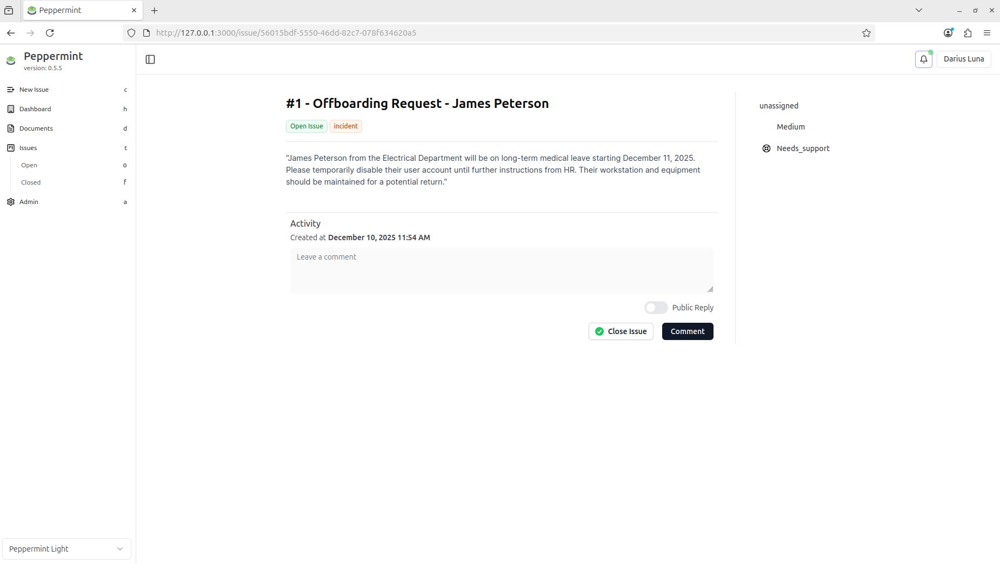
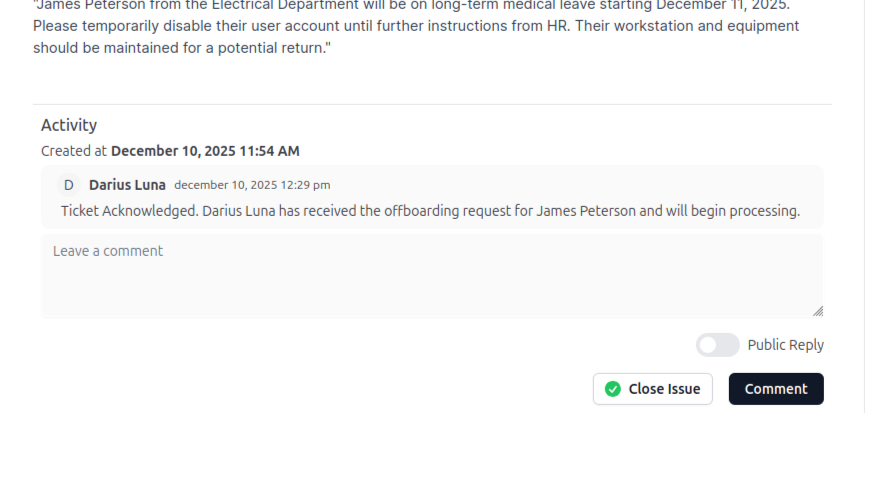
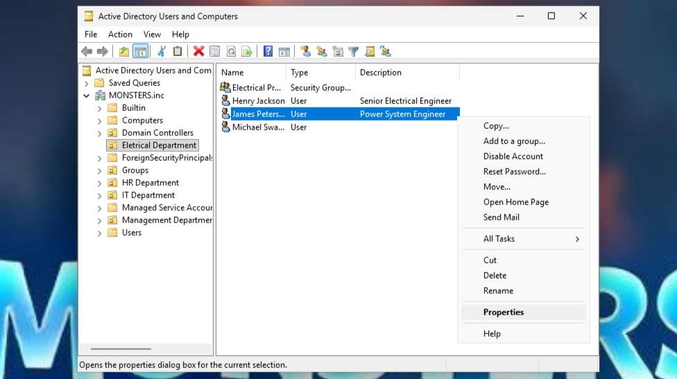
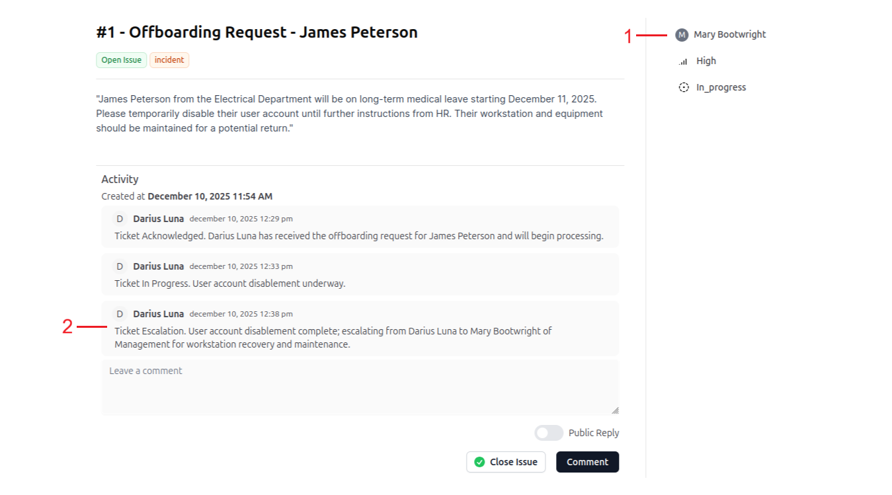

# Offboarding Ticket
This section documents the offboarding process handled through a service ticket. The goal is to demonstrate secure account deactivation, ticket escalation

#

### Ticket Acknowledgement
Based on the ticket description, the required tasks were:
* Disable the user account for James Peterson
* Escalate the ticket to the Management Department for further processing
The ticket was acknowledged with a comment to confirm ownership and maintain an audit trail of actions.

#

### Ticket In Progress
To maintain visibility and accountability:
1. Assign the ticket to the appropriate support personnel
1. Update the ticket status to In Progress
1. Add a comment indicating work has started
These steps ensure proper tracking before performing account-related actions.

#

### Disable User Account (Active Directory)
1. Launch Active Directory Users and Computers (dsa.msc)
1. Navigate to MONSTERS.inc > Electrical Department
1. Right-click James Peterson to view available account actions

1. Select Disable Account
1. Confirm that the account status reflects as disabled

Disabling the account immediately prevents unauthorized access while preserving the user object for auditing, data recovery, or future reference. Account deletion is typically performed only after all assets and data have been reviewed.

#

### Ticket Escalation
After disabling the account:
1. Reassign the ticket to Mary Bootwright (Management Department)
1. Add a comment indicating ticket escalation and completed actions

Escalation ensures management can proceed with remaining offboarding steps such as asset recovery, access reviews, and compliance checks.
