# Onboarding Ticket – Step-by-Step Documentation
This section documents the end-to-end onboarding process handled through a service ticket, from acknowledgment to closure. The goal is to demonstrate ticket lifecycle management, Active Directory administration, workstation setup, and secure software deployment.

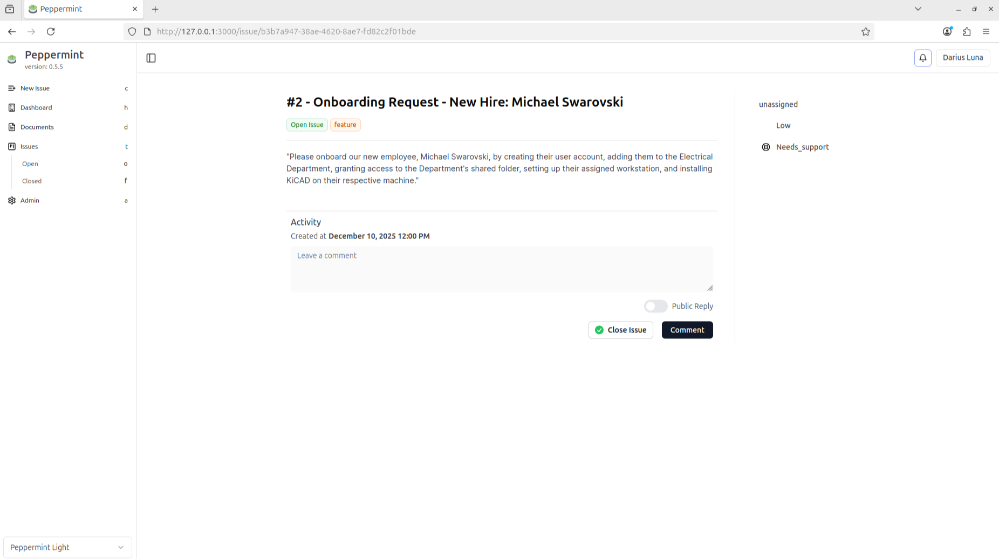

### Ticket Acknowledgement
Based on the ticket description, the required tasks were:
* Create a user account for Michael Swarovski (Electrical Department
* Add the user to the appropriate security group for shared folder access
* Configure and domain-join the workstation
* Install required software (KiCad)
* Close the ticket with proper documentation

The ticket was acknowledged with a comment to confirm ownership and ensure traceability of actions.
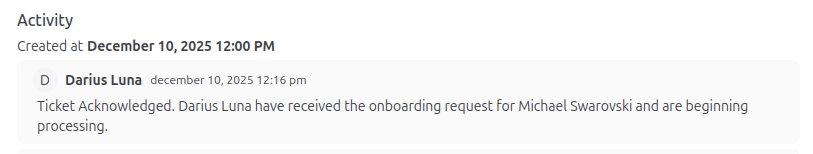

### Ticket In Progress
To maintain visibility and accountability:
1. Assign the ticket to the appropriate support personnel
1. Update the ticket status to In Progress
1. Add a comment indicating work has started

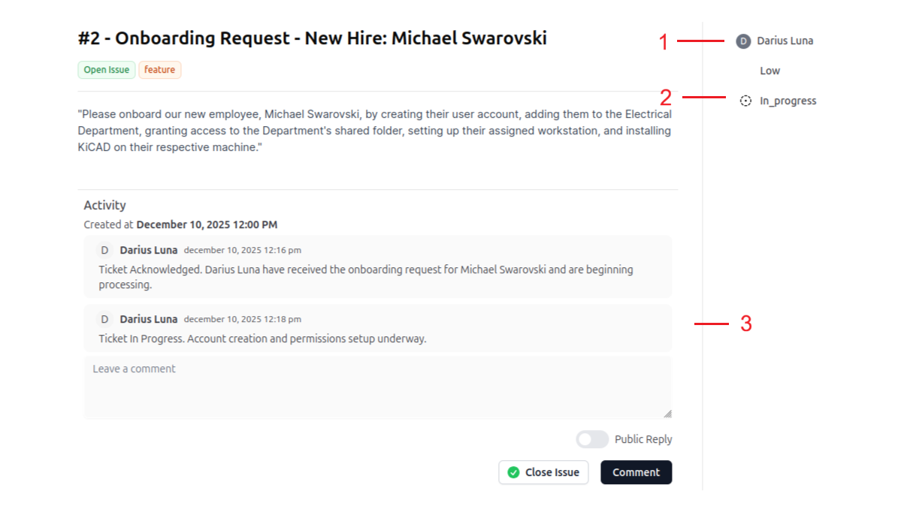
These steps ensure clear communication, especially in multi-technician environments.

### User Account Creation (Active Directory)
1. Launch Active Directory Users and Computers (dsa.msc)
1. Navigate to MONSTERS.inc > Electrical Department
1. Create a new user account with the username mike
1. Set an initial password (password change at next logon disabled for demo purposes)
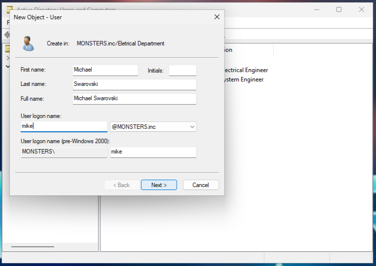

This automatically places the user in the correct Organizational Unit (OU).

### Group Membership & Shared Folder Access
To grant access to departmental resources:
1. Open the Electrical Projects security group
1. Add user mike as a member

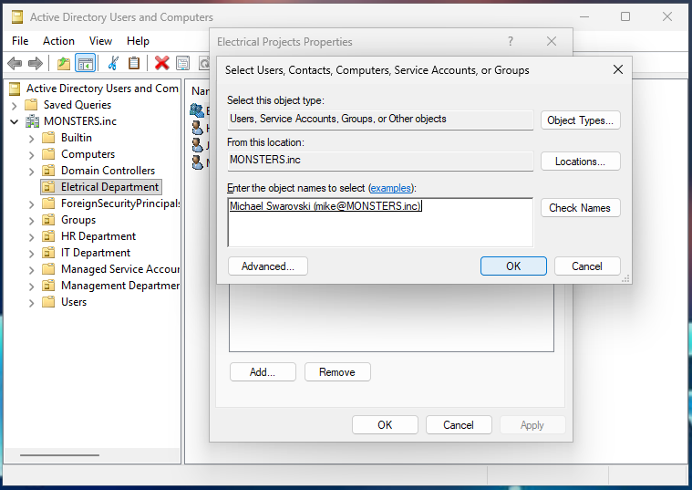

This group already has permissions to the Electrical Department’s shared folder, allowing access without assigning permissions directly to the user.

### Workstation Configuration & Domain Join
The workstation was configured remotely using TeamViewer.
Steps performed:
1. Remote connection established to the workstation
	
1. Renamed the PC from DESKTOP-XXXXXX to WS21
	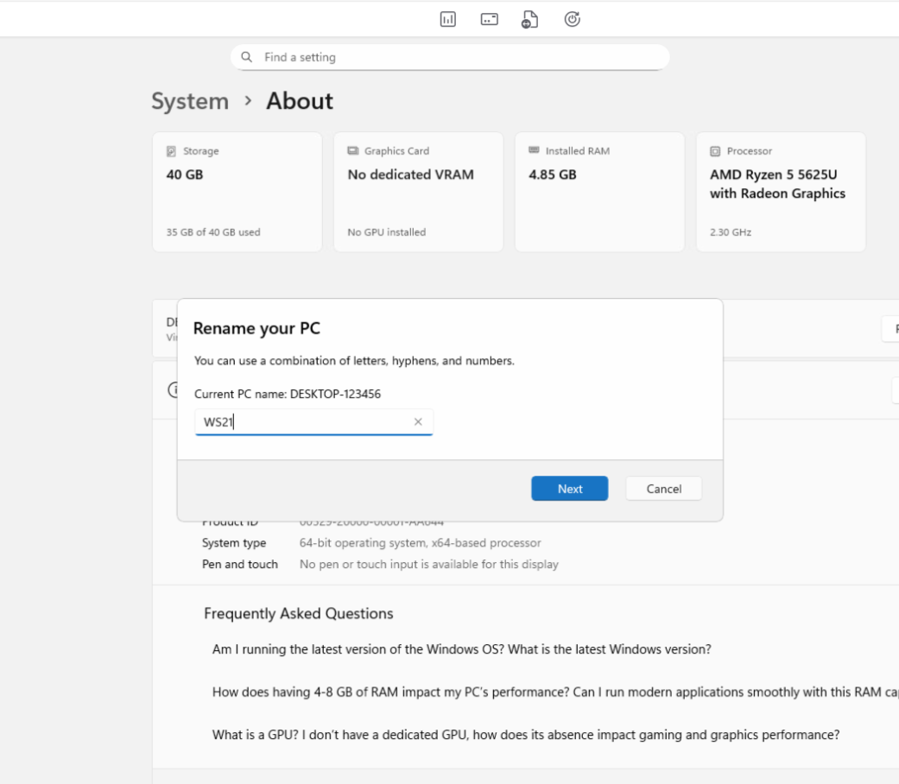
1. Connected the workstation to the NAT network hosting the Domain Controller
1. Configured IPv4 settings:
	* Network: 10.0.2.0/24
	* Default Gateway: 10.0.2.1
	* Preferred DNS: 10.0.2.3 (Domain Controller)
1. Joined the device to the domain MONSTERS.inc
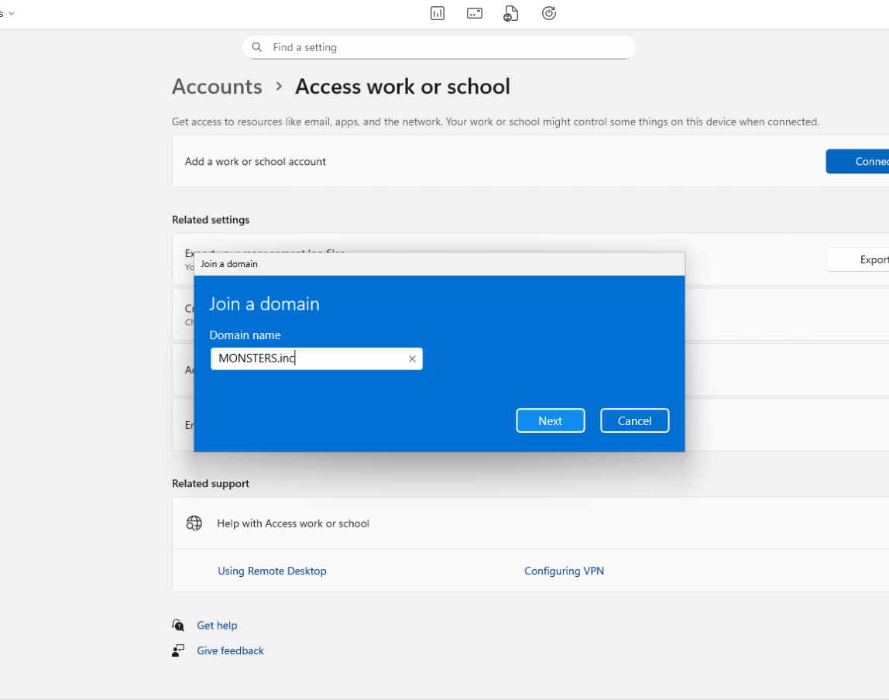
1. Restarted the workstation to apply changes
	Log in to the user account and finish the setup
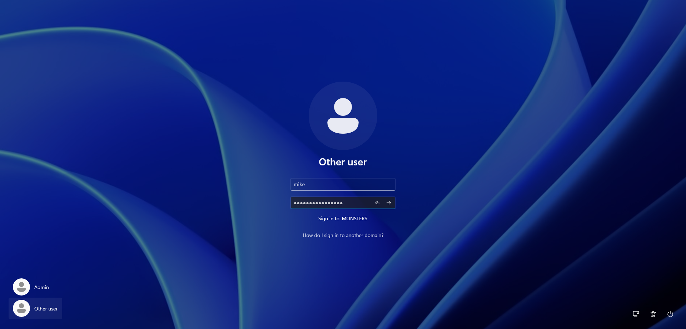
	Note: Domain join issues are commonly caused by incorrect DNS settings or the workstation not being connected to the correct virtual network.

### Shared Folder Mapping
To improve usability for the end user:
1. Reconnect remotely to WS21
1. Open File Explorer → Map Network Drive
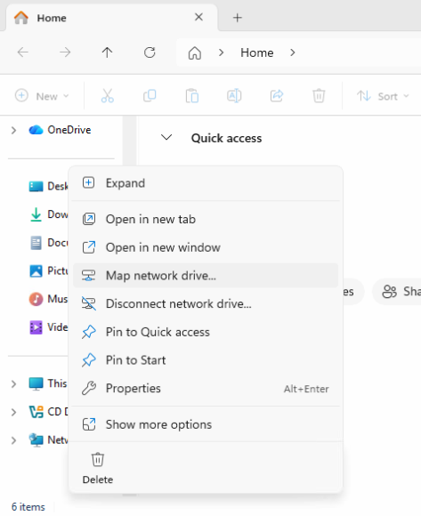
1. Map the Electrical Projects shared folder
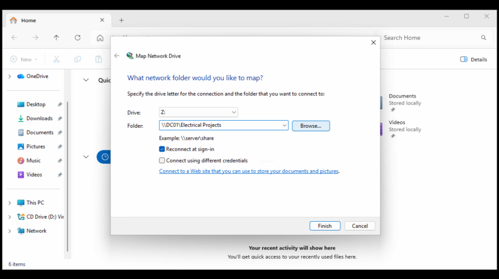
	User successfully accessing the Electrical Projects shared folder
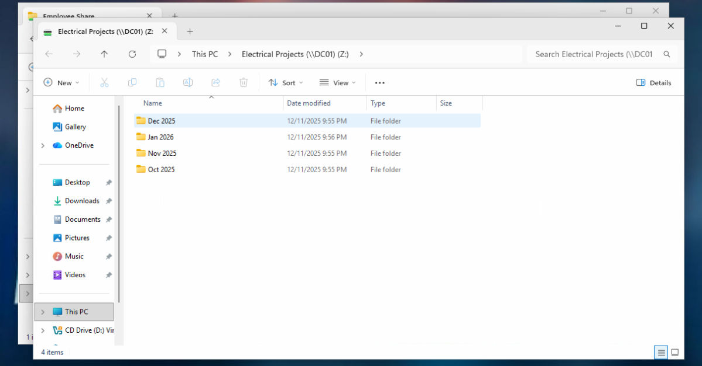
Mapping the drive allows instant access without manually entering the network path.

### Software Installation (Secure Practice)
Required software: KiCad
Steps:
1. Download the installer from the official source
1. Verify the file’s Digital Signature against the publisher information
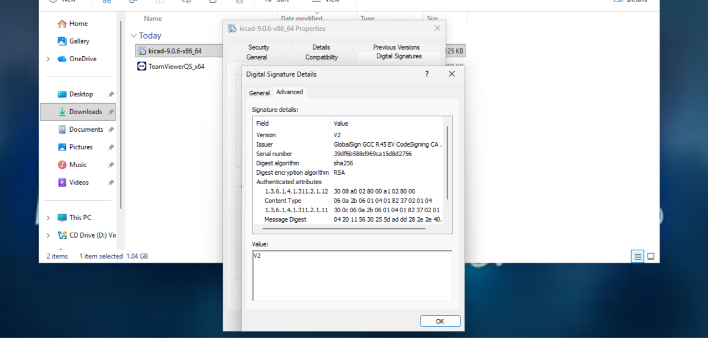
1. Proceed with installation after validation
Verifying installer integrity is a security best practice to prevent malware and unauthorized software from entering the environment.

### Ticket Closure
1. Update ticket status to Done
1. Add a final comment summarizing completed actions
1. Close the ticket
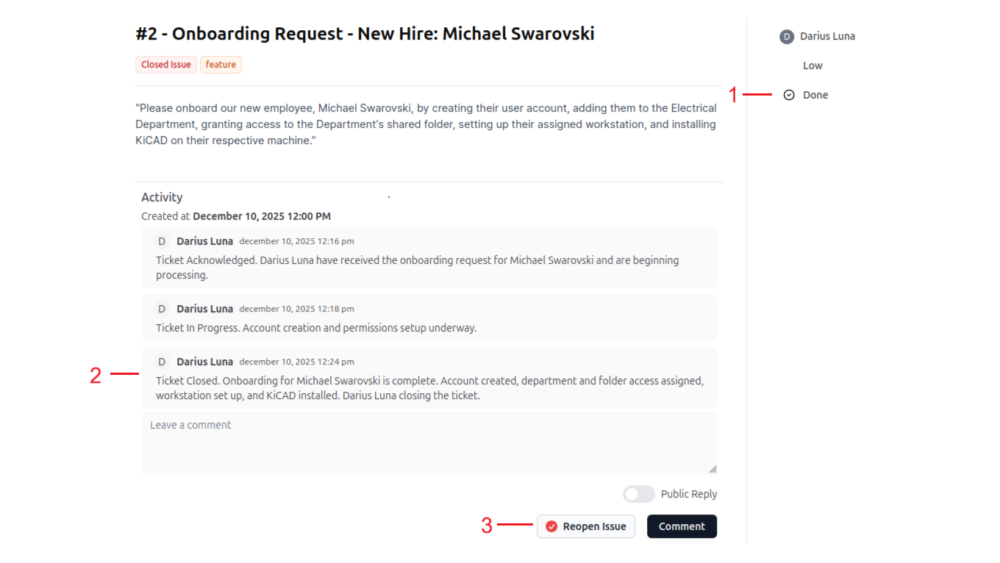
	Some tickets may require escalation instead of closure, depending on scope or access limitations.
